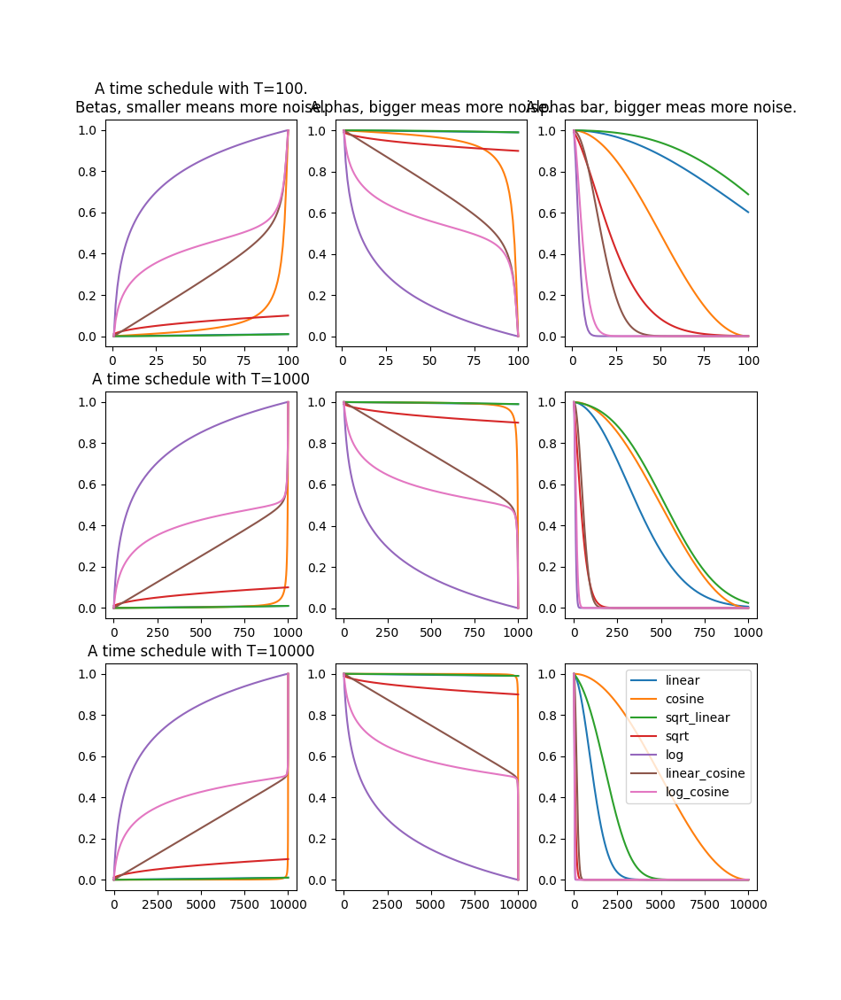

# Difussion Personal Implementation

THIS IS A WIP! Nothing is still of up to use or even read.

We are testing several diffusion methods:
- ddpm
- stable diffusion
- k-diffusion (to come)

## API

what do we need here:

...

## Beta schedule issue:

One of the most important parts of diffusion models is to set a correct beta schedule.

- The initial proposition is a linear schedule, wich is (from intuition and experiments)
  to a good idea, indeed, at the end of the process the sample is fairly noisy and we
  keep adding a fair amount of unnecessary noise.
- The cosine noise discussed in this [paper](https://arxiv.org/pdf/2102.09672.pdf) tries
  to solve the problem above, but to no avail in my opinion.
  While for small `T` it seems the betas are smooth, for larger values of `T` like
  1000~10000 we can see a problem with the amount of noise added at the end, the function
  seems to almost lose its smoothness.

For `alpha_bar` that is the cumulative product of `alpha` the courbe is more smooth in the
case of the cosine.
One temporary solution is to skip steps of diffusion. That is, skip some of the last steps
to clip the function of betas befor the end.

**TODO**: see what is more important in with respect to smoothness, `alpha` (equivalent to
`beta`) or `alpha_bar`

## Randomness of the guassian distribution and initial sample

The diffusion backward process begins with a full noise sample. I think that for, both
reproducibility of results and stability of the learning process is better to set a
global seed for the whole process.
